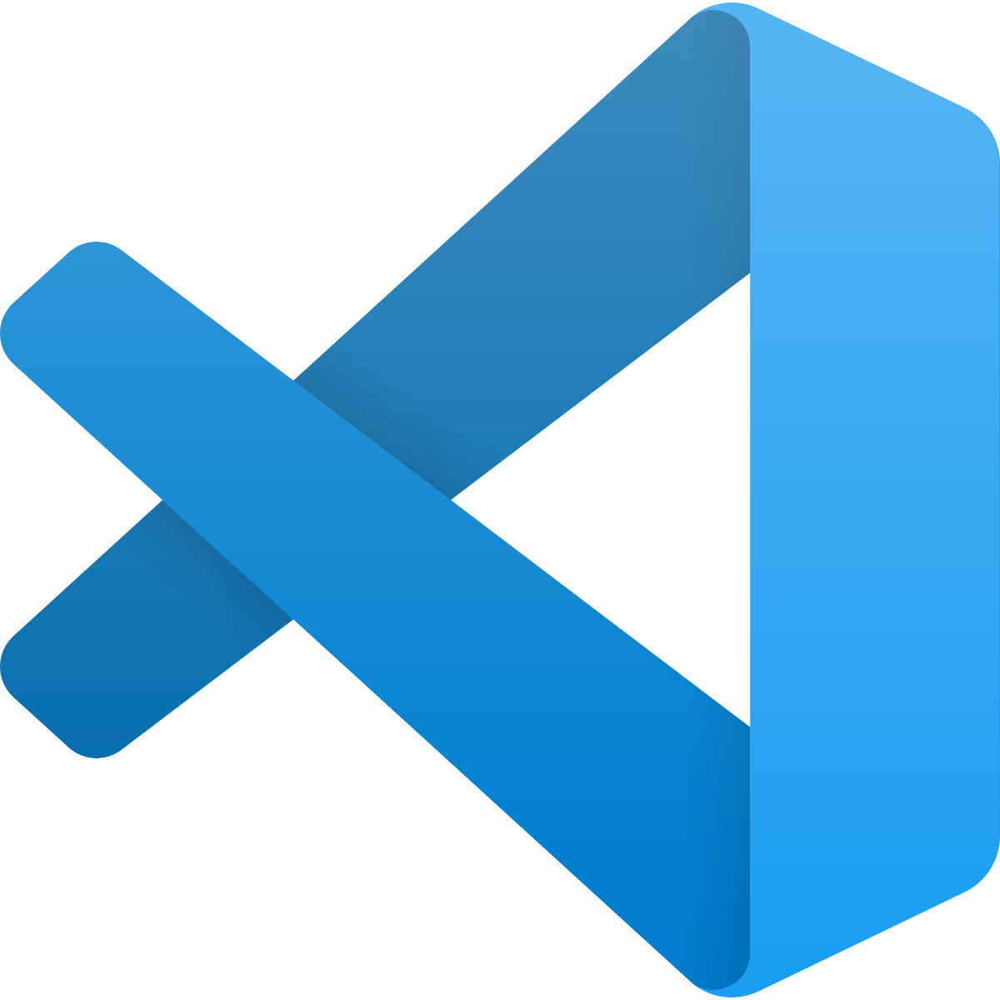
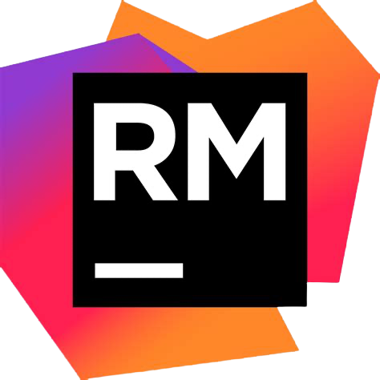
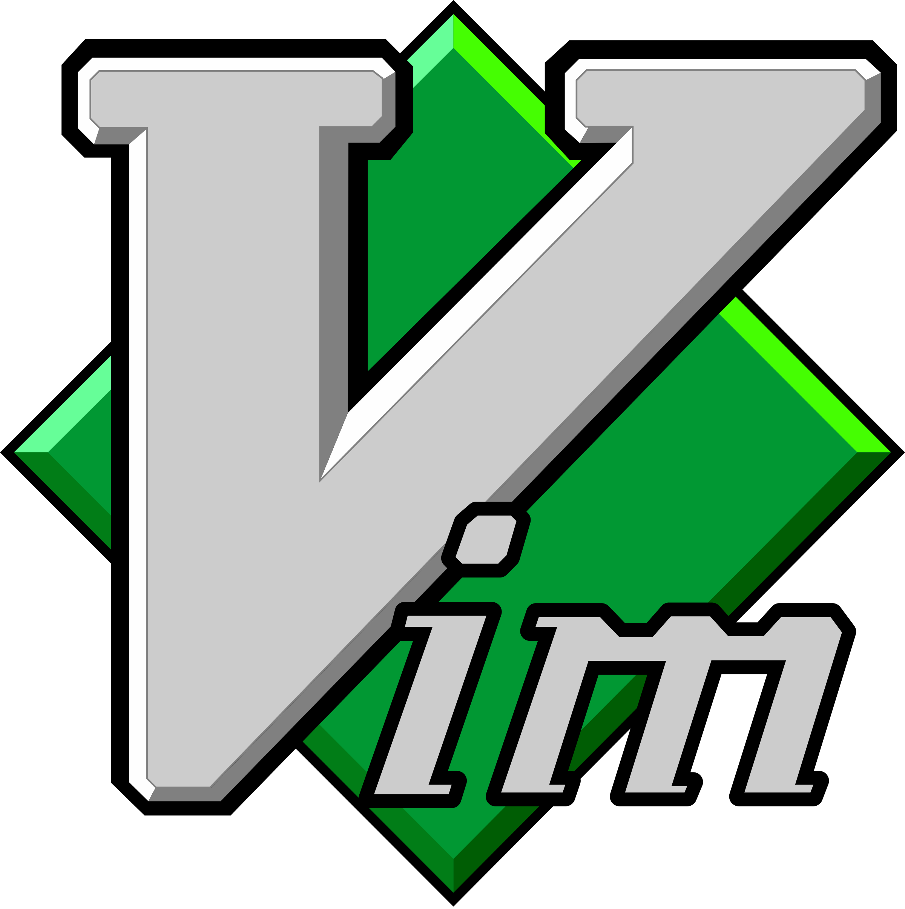

# Editor

## Requisitos

Para uma melhor compreensão do curso, é importante acompanhar
junto anotando e de fato executando cada parte do projeto, visto
isso vamos falar um pouco sobre setup de ambiente começando com
seu editor de código (apesar de ser algo muito pessoal, vou
recomendar três que acredito serem muito capazes).

---

<h1 align="center">
    
</h1>

## Visual Studio Code

Não podemos ficar sem falar do queridinho da modernidade VSCode para os intimos, é um editor de texto super acessivel e que pode se tornar uma IDE poderosa com seus milhares de plugin.

[Clique aqui para fazer o Download](https://code.visualstudio.com/download)

Para o melhor uso desse editor recomendo alguns plugins:

- [Ruby](https://marketplace.visualstudio.com/items?itemName=rebornix.Ruby)
- [Rubocop](https://marketplace.visualstudio.com/items?itemName=misogi.ruby-rubocop)
- [Rails](https://marketplace.visualstudio.com/items?itemName=bung87.rails)
- [Endwise](https://marketplace.visualstudio.com/items?itemName=kaiwood.endwise)
- [Snippets](https://marketplace.visualstudio.com/items?itemName=hridoy.rails-snippets)

<h1 align="center">
    
</h1>

## Rubymine

Não importa o que você precisa fazer sempre vai ter uma IDE da
jetbrains para auxiliar, e com ruby não é diferente, rubymine é
uma excelente IDE que auxilia tanto em projetos ruby padrão
quanto com projetos ruby on rails complexos oferecendo
autocomplete inteligente, navegação por nome de rota,
refatoramentos e muito mais.

[Clique aqui para fazer o Download](https://www.jetbrains.com/ruby/)

Rubymine é uma IDE completa então não é necessário nenhum plugin
relacionado a linguagem ou framework, tudo já vem ativado por
padrão.

<h1 align="center">
    
</h1>

## Vim

O meu favorito pessoal precisa estar aqui, é de longe a opção
mais minimalista dessa lista (inclusive que consome muito menos
recursos para quem tem computador/notebook fraco), mas não se
engane pelo minimalismo, pois ele foi e continua sendo uma das opções mais
usadas por rubistas(usuários da linguagem ruby) ao longo do mundo
por decadas.

Se você esta em um sistema linux ou mac, ele provavelmente já está disponivel no seu sistema, abra um terminal e execute `vimtutor` para mais detalhes.

Para ambientes windows e caso seu sistema não tenha: [Clique aqui para fazer o Download](https://www.vim.org/download.php)

Para o melhor uso desse editor, recomendo os seguintes plugins:

- [Ruby](https://github.com/vim-ruby/vim-ruby)
- [Rails](https://github.com/tpope/vim-rails)
- [Endwise](https://github.com/tpope/vim-endwise)
- [Linter para rubocop e afins](https://github.com/dense-analysis/ale)

> A He4rt tem um 4noobs sobre vim caso tenha interesse: [vim4noobs](https://github.com/luanmateuz/vim4noobs)

Próximo: [Instalando a linguagem ruby](/Ambiente/Linguagem.md)
