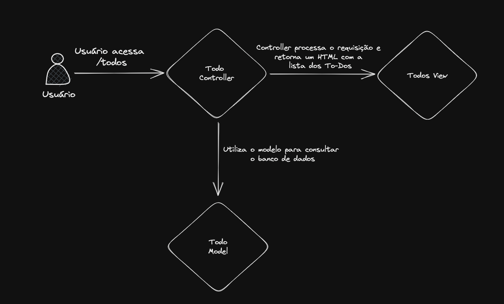
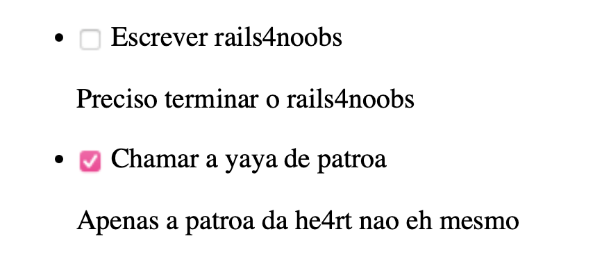

# Entendendo a arquitetura "Model-View-Controller" (MVC)

A arquitetura MVC é utilizada em todos os projetos por padrão quando utilizamos rails, ela existe para que possamos ter o minimo de separação de responsabilidade enquanto mantemos algo simples (visto que o rails visa prover uma base simples para que a aplicação seja criada em cima).

No diagrama abaixo vamos entender um fluxo de usuário para listar uma To-Dos (o famoso exemplo) e como o rails lida com cada etapa.

Bom, como podemos ver no diagrama acima o usuário abre o seu navegador e entra
no nosso site na rota `/todos`, no momento que ele aperta enter e o navegador
dispara uma chamada GET para a nossa API o controlador `todos_controller` processa esses
dados da chamada, busca a lista de to-dos do banco de dados utilizando o modelo `todo_model` e então retorna um template HTML que chamamos de view. Com isso o browser processa o HTML e devolve a sua pagina com a lista de itens conforme mostrado abaixo.

