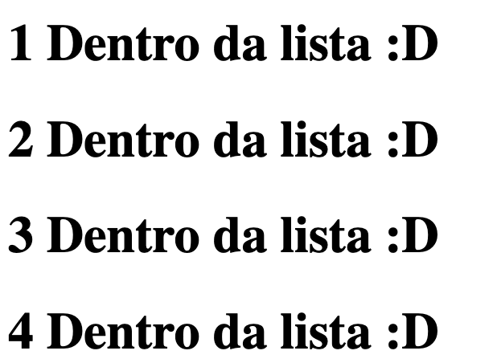

# Estruturas de Repetição

As estruturas de repetição servem para que possamos lidar com listas dentro dos nossos templates, como por exemplo uma lista de tarefas ou de usuários para alguma página em específico, abaixo temos as principais formas de percorrer listas:
- Each

De longe o mais usado para templates é o each, nele podemos percorrer uma lista diretamente e lidar com cada valor dentro da lista separadamente como podemos ver abaixo:

```erb
<% [1, 2, 3, 4].each do |numero| %>
  <h1><%= numero %> Dentro da lista :D</h1>
<% end %>
````

Com esse simples `each` temos o seguinte resultado:



- For

Apesar de menos usado, como vimos sobre ERB ser apenas um ruby embedado, podemos com certeza usar outras formas de repetição tendo o mesmo resultado como `for`:

```erb
<% for numero in [1, 2, 3, 4] %>
  <h1><%= numero %> Dentro da lista :D</h1>
<% end %>
```
