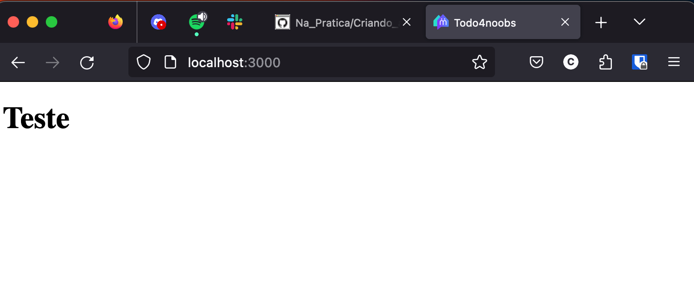

# Criando a primeira view

Como vimos no erro mostrado no capitulo anterior que diz `"No template for interactive request"`, estamos precisando definir a ultima camada na divisão de responsabilidade do nosso fluxo definido no [MVC](/Arquitetura/MVC.md) que é a view.

Esta view atualmente pode seguir duas opções que são
[JSON](https://www.alura.com.br/artigos/o-que-e-json?gclid=Cj0KCQjwj_ajBhCqARIsAA37s0xrWlk9Y7n1NbS0MVebv84YTaiN60Z9G8Y_ujOC_4xPBIlchhLo72waAm7dEALw_wcB)
ou HTML, nesse 4noobs vamos focar em retornar HTML.

Para isso vamos definir um simples template usando [ERB](/Explicacao/ERB/index.md) localizado na `app/views/todo/index.html.erb`.

```html
<h1>Teste</h1>
```

Agora recarregando a página(caso tenha cancelado o servidor, execute novamente com `rails server`) devemos ver a seguinte pagina:



Oba! Temos agora oficialmente nossa primeira rota pronta 🚀, agora vamos aprender um pouco mais sobre ERB para entender o basico de suas capacidades 😁

## Entendendo ERB mais a fundo

As principais estruturas lógicas para se entender ao criar templates com erb são:

- [Diferença entre tag de exibição e tag de controle](/Explicacao/ERB/Diferenca_entre_tag_de_exibicao_e_tag_de_controle.md)
- [Condicionais](/Explicacao/ERB/Condicionais.md)
- [Estruturas de repetição](/Explicacao/ERB/Estruturas_de_repeticao.md)

Agora que sabemos mais sobre a linguagem de template do rails, vamos criar rapidamente uma página apresentável para a nossa listagem de tarefas utilizando erb e css 🚀 [Melhorando nossa pagina de listagem de tarefas](/Na_Pratica/Melhorando_pagina_de_listagem_de_tarefas.md)
