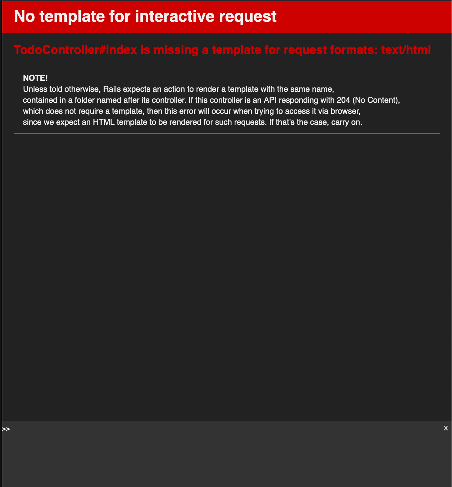

# Criando o primeiro controller

Agora que temos nosso modelo definido, vamos criar nossa primeira
rota e finalmente executar esse projeto pela primeira vez! Nós vamos criar um projeto localizado em `app/controllers/todo_controller.rb` e definir um simples controller:

```ruby
class TodoController < ApplicationController
  def index
  end
end
```

## Entendendo passo a passo

Como podemos ver essa classe [herda](https://guru-sp.github.io/tutorial_ruby/heranca.html) da classe `ApplicationController`, essa classe garante diversas facilidades quando vamos ligar com a comunicação HTTP da nossa aplicação. Nesta classe estamos definindo um metodo vazio chamado `index` que vai servir como ponto de partida para a nossa rota GET `/`.

A classe sozinha ainda não provê nenhuma funcionalidade com o nosso cliente final, para isso ainda precisamos registra-la como uma rota, faremos isso no arquivo `config/routes.rb` incluindo da seguinte maneira:

```ruby
Rails.application.routes.draw do
  get '/', to: 'todo#index' # <--- Linha que devemos inserir
end
```

Como podemos perceber, esse arquivo contem uma Domain Specific Language(DSL) para declarar rotas (padrão muito encontrado na comunidade), podemos definir facilmente o argumento(get), o caminho (/) e para onde vai ser mandado (no caso a classe todo no metodo index).

> Como pode perceber referenciamos apenas todo e não todo_controller pois o rails sabe que estamos nos referindo a um controlador nesse arquivo de rotas, isso esta diretamente ligado com a filosofia de [Convention Over Configuration](/Arquitetura/Convention_over_Configuration.md)
Agora com tudo declarado, devemos ser capazes de executar nosso projeto e ver tudo funcionando certo? Para isso vamos executar o seguinte comando:

```sh
$ rails server # também pode ser executado como rails s
```

Abrindo seu navegador na url `http://localhost:3000` devemos ver essa pagina:



Infelizmente ainda falta algo para que a nossa rota funcione 😥,
lembrando da arquitetura [MVC](/Arquitetura/MVC.md) percebemos
que ainda falta uma letra que cuida da camada final e visual para
o usuário. Vamos agora ver mais sobre as `views` e como o rails
entende que falta no nosso projeto para disparar um erro. [Criando a primeira view](/Na_Pratica/Criando_a_primeira_view.md)
