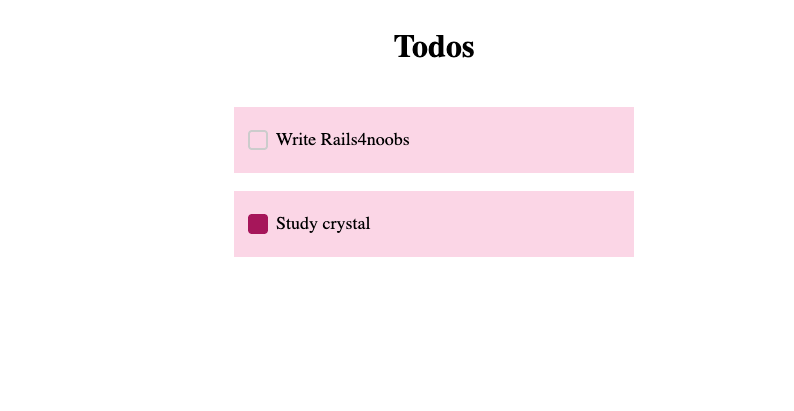

# Melhorando o controller de listagem de tarefas

Como vimos na mensagem de erro do modulo anterior não temos definido a variavel `@todos` para iterar e mostrar na tela com a nossa view.

O que precisamos entender primeiro é como o rails comunica entre controller e views, no caso utilizamos [variaveis de instancia](https://www.campuscode.com.br/conteudos/variaveis-e-self-em-ruby) que o framework automatica injeta ao renderizar a view.

Entendendo isso podemos ter nosso controller simples da seguinte forma:

```ruby
class TodoController < ApplicationController
  def index
    @todos = Todo.all
  end
end
```

Muito simples certo? a unica parte nova nessa classe é o uso do metodo `all` da classe `Todo` certo? Como ja vimos em modulos anteriores essa é a nossa entidade que utiliza `ActiveRecord` para comunicar com o banco de dados nessa tabela específica.

O metodo `all` nesse contexto retorna todas os registros da tabela "todo" na nossa aplicação e injeta na variavel de instancia para ser mostrada na view.

Agora visualizando a pagina veremos algo sendo mostrado corretamente 🚀:



Parabéns! Oficialmente temos a página de listagem de tarefas funcionando corretamente.

## Trabalhando nas outras rotas

Agora vamos continuar trabalhando um pouco no controller para virmos como podemos implementar as outras rotas definidas no modulo [O que vamos construir](/Na_Pratica/O_que_vamos_construir.md)

### Rota para visualizar uma tarefa unica

Para checar por exemplo a descrição de uma tarefa ou qualquer outro tipo de informação especifica de uma tarefa, poderiamos ter um botão que ao clicar leva o usuário para aquela tarefa especifica certo?

Podemos conseguir isso com uma rota `GET /tasks/:id` ou em termos simples uma rota `show`, que podemos definir de forma simples como mostrado abaixo:

```ruby
class TodoController < ApplicationController
  def show
    @todo = Todo.find(params[:id])
  end
end
```

Aqui podemos ver alguns novos conceitos novamente:

- O metodo `find` existe por padrão em classes ActiveRecord e recebe um ID(numérico ou string no caso de UUIDs) retornando uma instância de entidade.
- O objeto `params` é automaticamente injetado em controllers e é um hash contendo tudo o que o usuário envia para essa rota (seja pelo body, por query param, por path param, etc).

### Rota para criar uma nova tarefa

Agora vamos definir uma rota para cadastrar uma nova tarefa onde o estado `done` sera false por padrão, dessa forma o usuário pode sempre criar uma tarefa para fazer e depois clicar para marcar como feito.

Para isso vamos definir um metodo `create` que vai manipular o objeto `params` ja visto antes para retornar uma nova instancia da nossa entidade de tarefa.

```ruby
class TodoController < ApplicationController
 def create
   todo = Todo.new({
     title: todo_params[:title],
     description: todo_params[:description],
     done: false
   })

   if todo.save
     redirect_to todo_path(todo)
   else
     render :new
   end
 end

 private

 def todo_params
   params.require(:title).require(:description).permit(:title, :description)
 end
end
```

Agora temos muito mais código! vamos checar com calma tudo o que foi apresentado:

1. Temos um novo metodo `todo_params` que manipula o objeto `param` visto anteriormente

   1. Nas multiplas chamadas do metodo `require` estamos dizendo para o rails que esses campos **precisam** estar presentes nos dados enviados a essa rota, caso não for enviado vamos disparar um erro de paramêtro.
   2. Na ultima chamada do metodo `permit` estamos dizendo para o rails limpar o objeto que foi enviado e retornar apenas as keys que estamos passando, dessa forma montamos um objeto muito mais coeso e evitamos lidar com informações desnecessárias nas nossas rotas.

2. falar sobre path aqui
