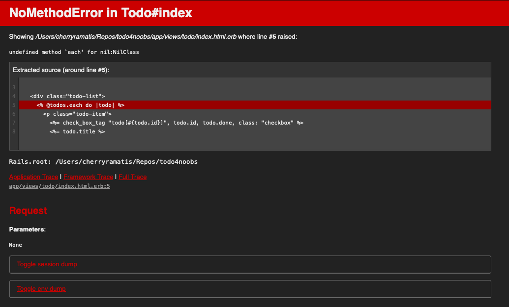

# Melhorando a pagina de listagem de tarefas

Agora vamos tratar mais diretamente da aplicação que será feita ao longo desse tutorial e vamos construir a base de CSS e HTML(ERB) para listar as tarefas, vamos passar rapidamente por um template de css e rever algumas estruturas de ERB, logo depois vamos olhar para a parte necessária no controller tudo bem? Vamos la!

## Template inicial para CSS

Segundo a estrutura de arquivos do rails podemos colocar nossos arquivos css na pasta `app/assets/stylesheets` que serão automaticamente carregadas no navegador, portanto vamos criar um pequeno padrão e isolar os estilos da nossa unica pagina no arquivo `app/assets/stylesheets/todo/index.css` (referenciando a mesma estrutura usada em `app/views/todo/index.html.erb`):

```css
.container {
  width: 100vw;
  height: 100vh;
  display: flex;
  flex-direction: column;
  align-items: center;
}

.todo-list {
  width: 400px;
}

.todo-item {
  padding: 20px 10px;
  display: flex;
  align-items: center;
  background-color: #FBD6E7;
  gap: 5px;
  font-size: 18px;
}

.checkbox {
  appearance: none;
  -webkit-appearance: none;
  -moz-appearance: none;
  width: 20px;
  height: 20px;
  border: 2px solid #ccc;
  border-radius: 4px;
  outline: none;
  transition: all 0.3s ease;
}

.checkbox:checked {
  background-color: #A6155A;
  border-color: #A6155A;
}

.checkbox:focus {
  box-shadow: 0 0 0 2px rgba(33, 150, 243, 0.5);
}
```

## Escrevendo o ERB

Agora que temos nossos estilos a postos, podemos começar a definir nossa view com o propósito de apresentar a lista de tarefas criadas no banco de dados. Para isso vamos abrir o arquivo `app/views/todo/index.html.erb` e inserir o seguinte código:

```erb
<div class="container">
  <h1>Todos</h1>

  <div class="todo-list">
    <% @todos.each do |todo| %>
      <p class="todo-item">
        <%= check_box_tag "todo[#{todo.id}]", todo.id, todo.done, class: "checkbox" %>
        <%= todo.title %>
      </p>
    <% end %>
  </div>
</div>
```

Acima temos uma [Estrutura de repetíção](/Explicacao/ERB/Estruturas_de_repeticao.md) como ja vimos anteriormente e dentro dela temos uma estrutura nova [check_box_tag](https://apidock.com/rails/v5.2.3/ActionView/Helpers/FormTagHelper/check_box_tag), essa é uma tag nova provida pela classe helper [ActionView](https://guides.rubyonrails.org/action_view_overview.html) que nos permite declarar tags especificas com variaveis (como no caso do todo dentro de uma estrutura de repetição) e todo o poder da linguagem ruby.

Como podemos ver na declaração da tag, o primeiro argumento da função `"todo[#{todo.id}]"` representa o campo `name=` do html, o segundo é utilizado para popular o campo `id=`, o terceiro é usado para popular o `value=` e controlar se a checkbox esta selecionada ou não, o ultimo campo é para que possamos declarar uma classe de estilização.

O HTML produzido por essa função é o seguinte:

```html
<input type="checkbox" name="todo[1]" id="todo_1" value="1" class="checkbox">
```

## Próximos passos

Visualizando a pagina no navegador temos outro erro como mostrado abaixo:



No próximo capitulo vamos nos aprofundar mais nos controllers e aprender como consultar o banco de dados para que possamos ajustar esse erro 🚀: [Melhorando controller de listagem de tarefas](Na_Pratica/Melhorando_controller_de_listagem_de_tarefas.md)
